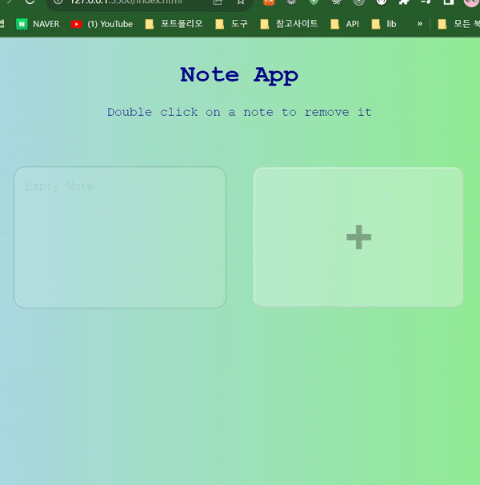

# Note-App


## 기능 
노트앱         
노트 추가, 삭제 가능 

## 학습 
### 1. CSS : box-sizing 
요소의 너비와 높이를 계산하는 방법을 지정

속성값|의미|예시|요소의 크기|
---|---|---|---|
content-box|기본값, CSS 표준이 정의한 초기 기본값. width와 height 속성이 콘텐츠 영역만 포함하고 안팎 여백과 테두리는 포함하지 않습니다.|.box {width: 350px; border: 10px solid black;}을 적용한 요소의 너비는 370px|너비 = 콘텐츠 너비, 높이 = 콘텐츠 높이
border-box|width 와 height 속성이 안쪽 여백과 테두리는 포함하고, 바깥 여백은 포함하지 않습니다. 안쪽 여백과 테두리가 요소 상자 안에 위치함을 유의|.box {width: 350px; border: 10px solid black;}을 적용한 요소의 너비는 350px|테두리 + 안쪽 여백 + 콘텐츠 너비, 높이 = 테두리 + 안쪽 여백 + 콘텐츠 높이

### 2. JS : window.localStorage  
__현재 도메인의 로컬 저장소에 접근__ 할 수 있게 해준다.

 __로컬 저장소는 웹 브라우저에서 각 도메인에 대해 할당해주는 저장 공간__ 으로, 여기에는 데이터를 영구적으로 보관할 수 있다.   

데이터 보관 시에는 데이터의 이름과 데이터의 실제 값을 각각 지정하며, 이때 데이터 타입은 문자열 형태만 허용된다.  

*영구적으로 보관의 의미*  
: 브라우저를 껐다가 켜거나 페이지를 새로고침해도 해당 페이지에 데이터가 남아있도록 할 수 있다는 뜻   

<br>

__로컬스토리지 사용법__   
: 로컬스토리지로부터 데이터를 읽거나 쓸 때에는 메소드를 이용해 접근 
메소드명|기능|사용 예
---|---|---|
setItem|키와 밸류를 전달받아 저장 | setItem("key", "value")
getItem|전달받은 키에 해당하는 밸류를 반환| getItem("key")
removeItem|전달받은 키에 해당하는 데이터 삭제|removeItem("key")
clear|모든 데이터 삭제|clear()

=> 로컬스토리지의 데이터 이름(키)은 중복될 수 없다. 그러나 밸류는 같은 것을 쓸 수 있다.  

### 3. JS : Array.prototype.forEach()  
각 배열 요소에 대해 제공된 함수를 한 번씩 실행 (배열에 대한 반복문)
```
const array1 = ['a', 'b', 'c'];

array1.forEach((element) => console.log(element));

// Expected output: "a"
// Expected output: "b"
// Expected output: "c"
```

매개변수|필수여부|의미|
---|---|---|
Current Value|필수|처리할 현재 요소|
Index|선택|처리할 현재 요소의 인덱스|
Array|선택|forEach 메서드를 호출한 배열|

```
const numbers = [1, 2, 3, 4, 5];
numbers.forEach((number, index) => {
    console.log('Index: ' + index + ' Value: ' + number);
});
// Index: 0 Value: 1
// Index: 1 Value: 2
// Index: 2 Value: 3
// Index: 3 Value: 4
// Index: 4 Value: 5
```

```
numbers.forEach((number, index, array) => {
    console.log(array);
});
// (5)[1,2,3,4,5]
// (5)[1,2,3,4,5]
// (5)[1,2,3,4,5]
// (5)[1,2,3,4,5]
// (5)[1,2,3,4,5]
```
### 4. JS : JSON.parse()과 JSON.stringify()
__JSON.parse()__  
JSON 문자열을 JavaScript 객체로 변환할 때는 JSON 객체의 parse() 메서드를 사용합니다. parse() 메서드는 JSON 문자열을 인자로 받고 결과값으로 JavaScript 객체를 반환합니다.

```
// json 문자열을 str에 저장

const str = `{
  "name": "홍길동",
  "age": 25,
  "married": false,
  "family": { "father": "홍판서", "mother": "춘섬" },
  "hobbies": ["독서", "도술"],
  "jobs": null
}`;

// json 문자열을 javascript 객체로 변환하여 obj에 저장  

const obj = JSON.parse(str);

console.log(obj);
//{
    name: "홍길동",
    age: 25,
    married: false,
    family: {
        father: "홍판서",
        mother: "춘섬"
    },
    hobbies: [
        "독서",
        "도술"
    ],
    jobs: null
}
```

javaScript 객체로 변환된 데이터는 .나 [] 기호를 사용하여 각 속성에 접근
```
> obj.name // '홍길동'
> obj.age // 25
> obj.married // false
> obj.family // {father: '홍판서', mother: '춘섬'}
> obj.family.mother // '춘섬'
> obj.hobbies // ['독서', '도술']
> obj.hobbies[1] // '도술'
> obj.jobs // null
```
__JSON.stringify()__  
반대로, JavaScript 객체를 JSON 문자열로 변환할 때 사용
```
// 자바스크립트 객체를 obj에 저장 
const obj = {
  name: "홍길동",
  age: 25,
  married: false,
  family: {
    father: "홍판서",
    mother: "춘섬",
  },
  hobbies: ["독서", "도술"],
  jobs: null,
};

// JSON.stringify()의 파라미터로 obj를 넘기고 str 에 저장 
const str = JSON.stringify(obj);

// log로 찍어보면 
console.log(str);
// 
'{
  "name":"홍길동",
  "age":25,
  "married":false,
  "family":{"father":"홍판서","mother":"춘섬"},
  "hobbies":["독서","도술"],"
  jobs":null
  }'
```
### 5. JS : Node.insertBefore()  
부모노드의 기준 점 노드 앞에 삽입 할 노드를 삽입합니다.
> 부모노드.insertBefore(삽입 할 노드, 기준 점 노드);  

```
<ul id="myList">
  <li>Coffee</li>
  <li>Tea</li>
</ul>

<script>
// Create a "li" element:
const newNode = document.createElement("li");

// Create a text node:
const textNode = document.createTextNode("Water");

// Append text node to "li" element:
newNode.appendChild(textNode);

// Insert before existing child:
const list = document.getElementById("myList");
list.insertBefore(newNode, list.children[0]);

// Water
// Coffee
// Tea
</script>
```

### 6. JS : alert vs confirm vs prompt
> alert 
 
__메시지__ 를 보여줍니다.   

> prompt
   
사용자에게 텍스트를 입력하라는 메시지를 띄워줌과 동시에, 입력 필드를 함께 제공합니다. __확인을 누르면 prompt 함수는 사용자가 입력한 문자열을 반환하고, 취소 또는 Esc를 누르면 null을 반환__ 합니다.

> confirm
  
사용자가 확인 또는 취소 버튼을 누를 때까지 메시지가 창에 보여집니다. __사용자가 확인 버튼을 누르면 true를, 취소 버튼이나 Esc를 누르면 false를 반환__ 합니다.

### 7. JS : filter()  
__특정 조건을 만족하는 값만 반환__ 받기를 원할 때 filter 메서드를 사용  
```
const words = ['spray', 'elite', 'exuberant', 'destruction', 'present'];

const result = words.filter((word) => word.length > 6);

console.log(result);
// Expected output: Array ["exuberant", "destruction", "present"]
```
__빈 요소에 대해서는 함수를 실행하지 않으며, 원래 배열을 변경하지 않음__   

*cf) map(), forEach()와 구분하기*

## 학습 출처 
**유튜브**  
https://www.youtube.com/@JavaScriptKing   
https://www.youtube.com/watch?v=N7oln9Z3WYg  

**CSS**  
https://developer.mozilla.org/ko/docs/Web/CSS/box-sizing   

**JS**  
https://developer.mozilla.org/ko/docs/Web/JavaScript/Reference/Global_Objects/Array/forEach  
https://www.freecodecamp.org/korean/news/javascript-foreach-how-to-loop-through-an-array/   
https://www.daleseo.com/js-json/   
https://www.w3schools.com/jsref/met_node_insertbefore.asp
https://ko.javascript.info/alert-prompt-confirm  
https://velog.io/@haleyjun/JavaScript-filter-%EC%82%AC%EC%9A%A9%EB%B2%95  
https://www.w3schools.com/jsref/jsref_filter.asp  

**키워드**
- box-sizing  
- window.localStorage
- Array.prototype.forEach()
- JSON.parse()
- Node.insertBefore()  
- alert vs confirm vs prompt
- filter() 